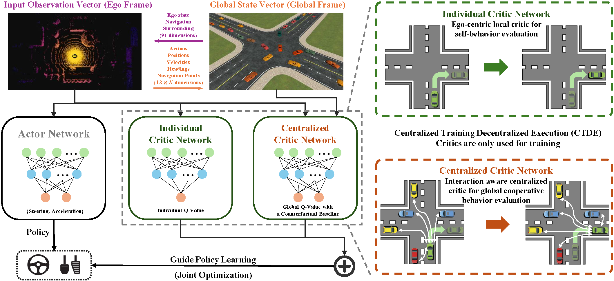

<div align="center">
<h1>&#x1FA99; COIN: Collaborative Interaction-Aware Multi-Agent Reinforcement Learning for Self-Driving Systems</h1>
<a href="https://arxiv.org/abs/2603.24931"></a>
<a href="https://marmotlab.github.io/COIN/"></a>

<a href="https://scholar.google.com/citations?user=o9zHCC0AAAAJ&amp;hl=zh-CN">Yifeng Zhang</a><sup>1</sup>,
<a href="https://scholar.google.com/citations?user=bmLr54AAAAAJ&amp;hl=zh-CN">Jieming Chen</a><sup>2</sup>,
Tingguang Zhou<sup>1</sup><br>
<a href="https://scholar.google.com/citations?user=rTz0anAAAAAJ&amp;hl=en">Tanishq Duhan</a><sup>1</sup>,
<a href="https://scholar.google.com/citations?user=ncDpC9gAAAAJ&amp;hl=zh-CN">Jianghong Dong</a><sup>3,*</sup>,
<a href="https://scholar.google.com/citations?user=t7r7tjUAAAAJ&amp;hl=zh-CN">Yuhong Cao</a><sup>1</sup>,
<a href="https://scholar.google.com/citations?user=n7NzZ0sAAAAJ&amp;hl=zh-CN">Guillaume Sartoretti</a><sup>1</sup>

<sup>1</sup>National University of Singapore
<sup>2</sup>Hong Kong Polytechnic University
<sup>3</sup>Tsinghua University

**Communications in Transportation Research (COMMTR) 2026**
</div>

<div align="center">
  
</div>

## Installation

### 1. Create an environment
```bash
conda create -n coin python=3.9
conda activate coin
```

### 2. Clone this repository

```bash
git clone https://github.com/marmotlab/COIN
cd COIN
```

### 3. Install MetaDrive

Install MetaDrive (0.4.2.3) via:

```bash
git clone https://github.com/metadriverse/metadrive.git
cd metadrive
pip install -e .
```

You can verify the installation of MetaDrive via running the testing script:

```bash
# Go to a folder where no sub-folder calls metadrive
python -m metadrive.examples.profile_metadrive
```

Note that please do not run the above command in a folder that has a sub-folder called `./metadrive`.

### 4. Install COIN dependencies

```bash
pip install -r requirements.txt
```

Notes:
- GPU is recommended for training, but the code can fall back to CPU.
- If you already have a working MetaDrive installation, check version compatibility before mixing environments.

## Training

Train COIN with the main script:

```bash
python td3_main.py --env_name intersection --seed 1000
```

`--env_name` supports three scenarios:

- `intersection`
- `roundabout`
- `bottleneck`

Note: For all reported experiments, we train the model with 8 different random seeds: `1000, 2000, 3000, 4000, 5000, 6000, 7000, 8000`. 

Training outputs are saved under a timestamped directory in `runs/`, including:

- `model/` for checkpoints,
- `train/` for TensorBoard logs,
- `result/` for metrics,
- `gifs/` for rendered rollouts.

To monitor training:

```bash
tensorboard --logdir runs
```

## Evaluation

Evaluate a trained model with:

```bash
python td3_eval.py --env_name intersection --model_path runs/<your_run_dir> --num_eval 20 --gui True
```

What the evaluation script does:

- loads the best checkpoint from `--model_path`,
- evaluates multiple traffic densities (e.g., initial agents counts),
- saves summary JSON files into `result/`,
- exports top-down GIFs into `gifs/`.

If you are running on a headless server, set:

```bash
python td3_eval.py --env_name bottleneck --model_path runs/<your_run_dir> --gui False
```

## Results

For training and evaluating baseline methods, please refer to the [CoPO](https://github.com/decisionforce/CoPO) codebase and its configuration setup:


<div align="center">
  
</div>

## Demos
For detailed qualitative examples and additional demos, please refer to the
[Project Website](https://marmotlab.github.io/COIN/).


## Acknowledgement

COIN is greatly inspired by the following outstanding contributions to the open-source community:
[MetaDrive](https://github.com/metadriverse/metadrive),
[CoPO](https://github.com/decisionforce/CoPO).


## Citation

If you find this repository useful, please cite the paper:

```bibtex
@article{zhang2026coin,
  title   = {COIN: Collaborative Interaction-Aware Multi-Agent Reinforcement Learning for Self-Driving Systems},
  author  = {Zhang, Yifeng and Chen, Jieming and Zhou, Tingguang and Duhan, Tanishq and Dong, Jianghong and Cao, Yuhong and Sartoretti, Guillaume},
  journal = {arXiv preprint arXiv:2603.24931},
  year    = {2026}
}
```

## License

This project is licensed under the **MIT License** - see the [LICENSE](LICENSE) file for details.

© 2026 [MARMot Lab](https://marmotlab.org/) @ NUS-ME
